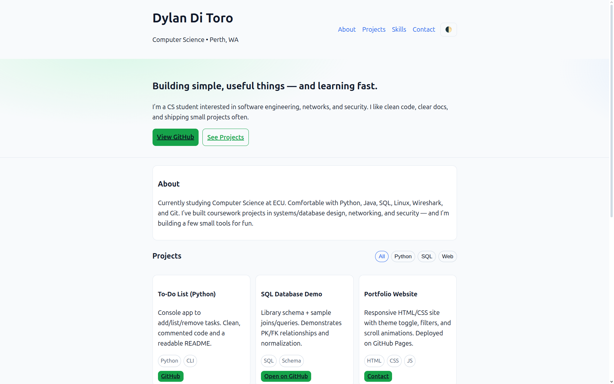
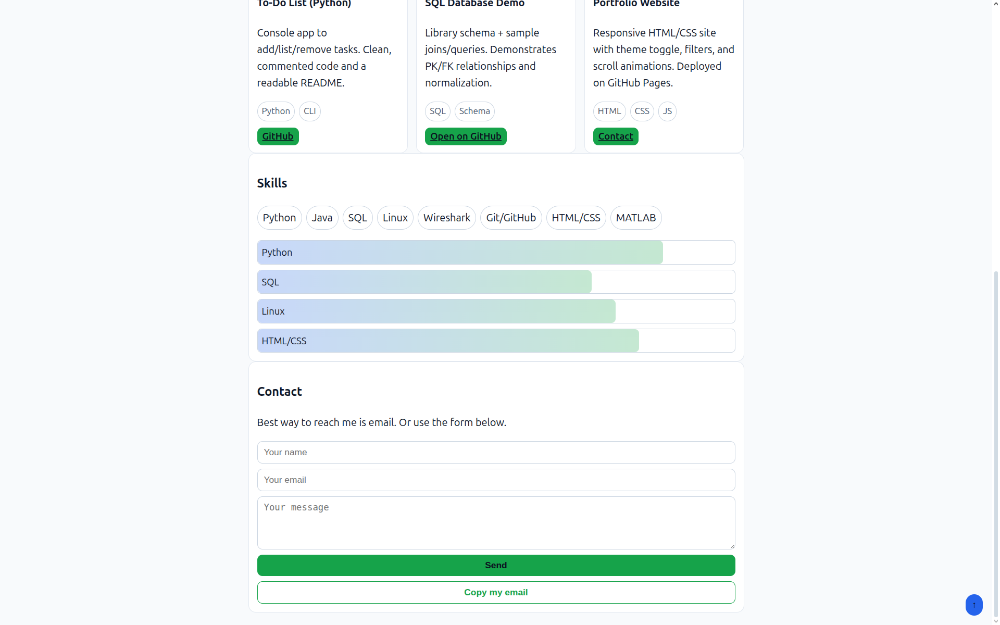
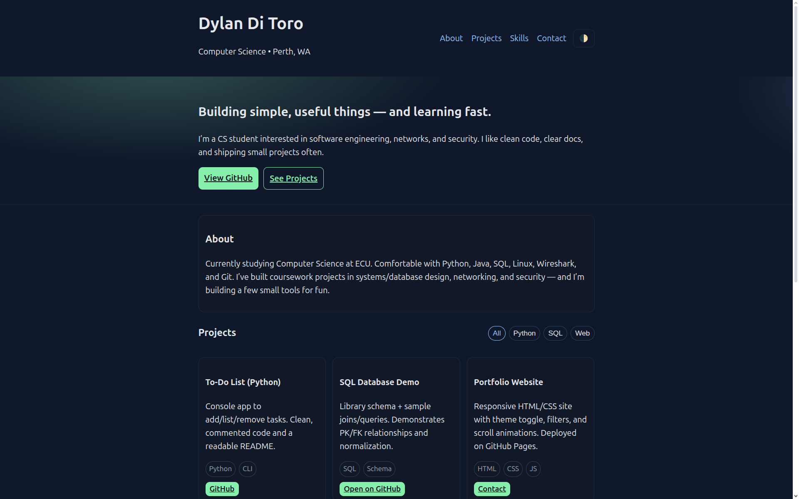
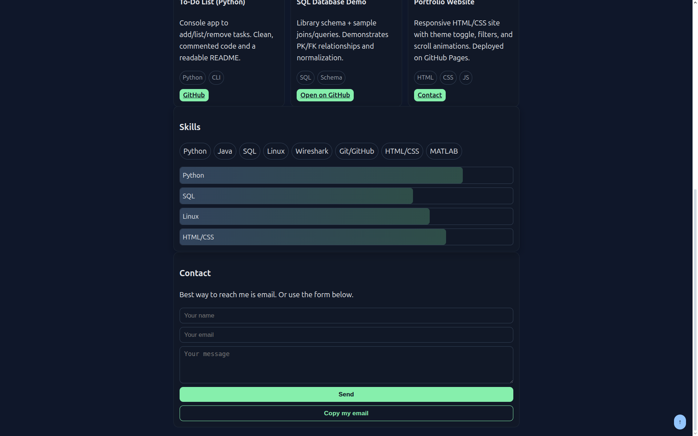

# 🌐 Dylan Di Toro — Portfolio Website

This is my personal portfolio website built with **HTML, CSS, and vanilla JavaScript**.  
It showcases my projects, skills, and contact details in a clean and responsive design.  
The site is hosted on **GitHub Pages** so it’s always live and easy to update.

---

## ✨ Features
- 🌓 **Dark/Light Theme Toggle** (remembers preference with localStorage)  
- 🎴 **Interactive Project Cards** with hover animations  
- 🔍 **Filterable Projects** (All / Python / SQL / Web)  
- 🎞 **Scroll-Reveal Animations** for smooth loading  
- ⬆️ **Back-to-Top Button** for easy navigation  
- 📬 **Contact Form** (via Formspree) + “Copy my email” button  
- 📱 **Responsive Layout** — works on desktop, tablet, and mobile  

---

## 📂 Project Structure
portfolio-site/
│── index.html # Main site structure
│── style.css # Styling (dark/light themes, animations, layout)
│── README.md # This file

---
## 📸 Screenshots
### Light Mode



### Dark Mode




---

## 🚀 Live Demo
👉 [View Portfolio Site](https://dylanditoro.github.io/portfolio-site/) 

---

## 🛠️ How to Run Locally
1. Clone the repository:
   ```bash
   git clone https://github.com/dylanditoro/portfolio-site.git
   cd portfolio-site

2. Open index.html in the browser

 firefox index.html
# or
google-chrome index.html

3. Or run a local test server:

python3 -m http.server 8000

Then visit http://localhost:8000

📧 Contact

Email: ditorodylan@gmail.com

GitHub: dylanditoro